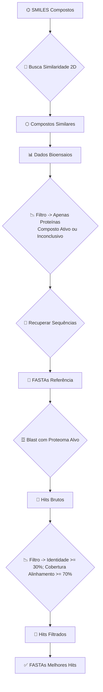

# Notebook Pipeline de Proteinas Alvo
Este projeto tem como objetivo encontrar potenciais **proteínas alvo** para **compostos orgânicos** em **proteômas alvo**. 

O pipeline se baseia na similaridade de compostos e proteínas para encontrar proteínas identicas ou similares a proteínas testadas nos compostos orgânicos de interesse ou similares. Os dados brutos deste pipeline são oriundos de Bioensaios depositados no [PubChem](https://pubchem.ncbi.nlm.nih.gov).

O Script base foi montado com o intuito de ser o mais didático possível, facilitando a utilização do usuário e entendimento de todo o pipeline.

## 🎛️ Requisitos

### Sistema
- Linux (Ubuntu 24.04+) ou Windows com WSL
- **Miniconda3** ou Anaconda, com **mamba** (**recomendados**)
- Python 3.12+
- 4 GB RAM mínimo

### Instalando Miniconda3 + mamba
Por questões de otimização, utilizo miniconda3 com mamba. Recomendo pela eficiência de ambos.

```bash
# Para instalar o Miniconda3
curl -O https://repo.anaconda.com/miniconda/Miniconda3-latest-Linux-x86_64.sh
bash Miniconda3-latest-Linux-x86_64.sh

# Siga a instalação padrão, recomenda-se instalar no home directory (~)
# Feita a instalação, reinicie o terminal
source ~/.bashrc

# Verifique se a versão, para confirmar a instalação
conda --version

# Configurando canais úteis
conda config --add channels bioconda
conda config --add channels conda-forge
conda config --set channel_priority strict

# Para instalar o mamba
conda install -n base -c conda-forge mamba
```

## 🛠️ Inicialização
Utilize os seguintes comandos para baixar o repositório e criar o ambiente com as dependencias necessárias:
```bash
# Baixar o repositório
git clone https://github.com/Peagua/proteinas-alvo-notebook.git
cd proteinas-alvo-notebook

# Criar o ambiente virtual
# Pelo mamba (Recomendado)
mamba env create -f environment.yml

# Pelo conda
conda env create -f envoronment.yml

# Ativando o ambiente
conda activate pipeline-proteinas-alvo
```

Com o repositório e todas as dependêncais instaladas, basta utilizar o notebook [script-base.ipynb](script-base.ipynb), todo o passo a passo para funcionamento do pipeline está no próprio script.


## 🖥️ VSCode

Ao executar o pipeline pelo VSCode, são necessárias algumas extensões: 

✅ [Python](https://code.visualstudio.com/docs/languages/python)

✅ [Jupyter](https://code.visualstudio.com/docs/datascience/jupyter-notebooks) 

☑️ [WSL](https://code.visualstudio.com/docs/remote/wsl) (se utilizar Windows)


**NOTA**: O pipeline foi testado apenas no VSCode, utilizando terminal WSL integrado. Ainda está sendo testada a possibilidade de rodar o pipeline diretamente pelo Jupyter local.

## 🏗️ Workflow


- ✅ Cada etapa guarda seus outputs em pastas dedicadas.

- 📄 **Output Final:** Arquivo .fasta, para cada composto buscado, contendo as sequências dos melhores hits.

- 🔎 **Output Adicional no <u>Terminal</u>:** Busca por similaridade da estrutura no PDB -> Verificar se os melhores hits tem estrutura experimental depositada ou encontrar similar para servir de template.

## 📡 Contato
Caso tenha alguma dúvida sobre o funcionamento do script, sugestão de melhoria, oportunidade de colaboração ou queira apenas saber mais sobre o projeto, entre em contato pelo e-mail: pedro.teodoro@ufu.br
